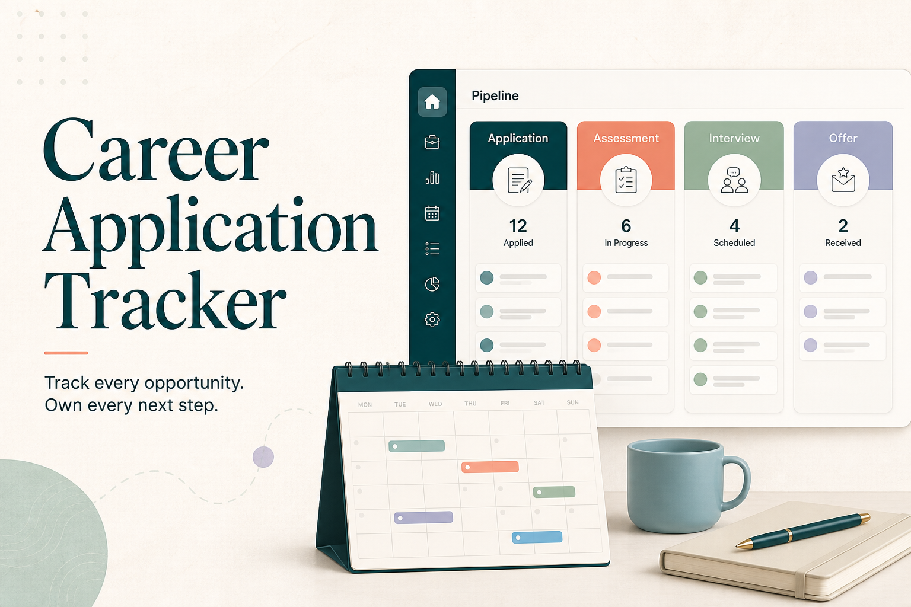

# Career Application Tracker

<p align="center">
  
</p>

<p align="center">
  A private-by-default calendar and pipeline tracker for job applications, assessments, interviews and offers.
</p>

<p align="center">
  <a href="https://qiqi068-casey.github.io/autumn-recruitment-calendar/"><strong>Live Demo</strong></a>
  ·
  <a href="https://github.com/qiqi068-casey/autumn-recruitment-calendar/actions/workflows/deploy-pages.yml">
    
  </a>
</p>

## Overview

Career Application Tracker brings application deadlines, assessments, interviews and target companies into one continuous calendar. It is designed for students, graduates and experienced professionals who want a clear view of every opportunity, its current stage and the next action required.

The app works without an account or backend. Personal application data stays in the visitor's browser and is never included in the public repository.

## Features

- Track application deadlines, assessments and interviews on a continuous calendar
- Count unique companies and monitor weekly task and interview progress automatically
- Copy an existing event to another date and update its recruitment stage without re-entering company, role, link or notes
- Organize prospective employers into high- and low-interest application queues
- Search by company or role and mark events as complete
- Switch between English and Chinese interfaces
- Display an optional China public-holiday overlay in Chinese mode
- Save schedules, notes, preferences and company lists automatically in the browser
- Use the responsive interface on desktop and mobile

## Copy and advance an application

When an application moves from an assessment to an interview, the existing details can be reused:

1. Select the original event and click the copy button `⧉`.
2. Choose the target date on the calendar.
3. Click **Paste**.
4. Update the stage, date or time in the pre-filled form.
5. Save the new event.

The original event remains in the timeline, creating a lightweight history of the application journey.

## Privacy model

The app stores schedules, notes, target companies and language preferences in browser `localStorage`.

- No account or sign-in is required
- No personal application data is sent to a server
- Each visitor sees only the data saved in their own browser
- Data does not automatically move between browsers, devices or domains
- Clearing site data removes locally stored records

The public demo and repository contain no personal job-application records.

## Tech stack

- React 19
- TypeScript
- Vite and vinext
- GitHub Actions
- GitHub Pages
- Browser `localStorage`

## Run locally

Node.js 22.13 or newer is recommended.

```bash
npm install
npm run dev
```

Build the static GitHub Pages version:

```bash
npm run build:pages
```

## Deployment

Every push to `main` runs the workflow in `.github/workflows/deploy-pages.yml`. A successful workflow publishes the latest version to:

<https://qiqi068-casey.github.io/autumn-recruitment-calendar/>

## Roadmap

- Export and import local data for backup and migration
- Optional cross-device synchronization
- Additional recruitment-pipeline analytics
